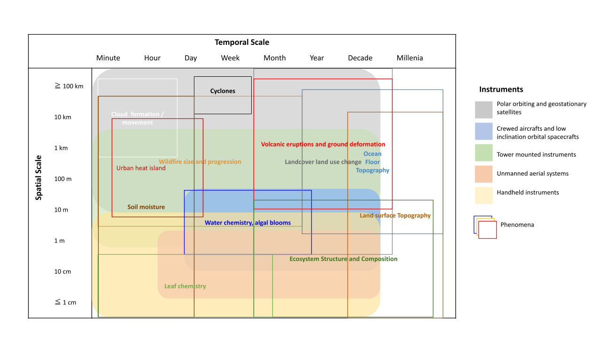

---
header-includes:
- \usepackage{setspace}\doublespacing
- \usepackage[left]{lineno}
bibliography: references.bib
# mainfont: Times New Roman
fontsize: 12pt
geometry: margin=1in
output:
  pdf_document: 
    latex_engine: xelatex
  word_document: default
link-citations: yes
linkcolor: RoyalBlue
urlcolor: RoyalBlue
links-as-notes: no
---

```{r setup, include=FALSE}
knitr::opts_chunk$set(echo = TRUE)
```

\pagenumbering{arabic} 

\linenumbers

Title: Ten simple rules for working with high-resolution remote sensing data

Adam L.  Mahood^1,2,`*`^, Maxwell B. Joseph^1^, Anna I. Spiers^1,3^, Michael J. Koontz^1^, Nayani Ilangakoon^1^, Kylen Solvik^1,2^, Nathan Quarderer^1^, Joe McGlinchy^1^, Victoria M. Scholl^1,2^, Lise St. Denis^1^, Chelsea Nagy^1,2^, Anna Braswell^4,5^, Matthew W. Rossi^1^, Lauren Herwehe^1,2^, Leah Wasser^1,2^, Megan E. Cattau^6^, Virginia Iglesias^1^, Fangfang Yao^2^, Stefan Leyk^1,2,7^, Jennifer K. Balch^1,2^, 

^1^ Department of Geography, University of Colorado Boulder, Boulder, CO, USA

^2^ Earth Lab, University of Colorado, Boulder, CO, USA

^3^ Department of Ecology and Evolutionary Biology, University of Colorado Boulder, Boulder, CO, USA

^4^ School of Forest, Fisheries, and Geomatic Sciences, Institute of Food and Agricultural Sciences, University of Florida,  Gainesville, FL, USA

^5^ Florida Sea Grant, Institute of Food and Agricultural Sciences, University of Florida, Gainesville, USA

^6^ Department of Human-Environment Systems, Boise State University, Boise, ID, USA

^7^ Institute of Behavioral Science, University of Colorado Boulder, Boulder, CO, USA

`*` Corresponding author: admahood@gmail.com


# Abstract

Researchers in Earth and environmental science can extract incredible value from high-resolution (sub-meter, sub-hourly or hyper-spectral) remote sensing data, but these data can be difficult to use. Correct, appropriate and competent use of such data requires skills from remote sensing and the data sciences that are rarely taught together. In practice, many researchers teach themselves how to use high-resolution remote sensing data with ad hoc trial and error processes, often resulting in wasted effort and resources. In order to implement a consistent strategy, we outline ten “rules” with examples from Earth and environmental science to help academic researchers and professionals in industry work more effectively and competently with high-resolution data.

# Introduction

The data revolution brings a deluge of Earth observations from numerous and diverse sensors. Many of these data are collected remotely: from space, the air, or underwater, and are of increasingly high-resolution, providing detailed spatial, temporal, radiometric, and/or spectral information (Figure 1). Earth and environmental scientists as well as professionals with analytical or computational backgrounds increasingly use high-resolution remote sensing data, but learning how to do this correctly and effectively can be difficult. In this article, we outline ten simple rules to help Earth and environmental researchers make informed decisions about the use and benefits of high-resolution remote sensing data.

Current understanding of high-resolution may include sub-meter, sub-hourly or hyper-spectral, but this is constantly changing, and what is considered high-resolution has to be considered in the context of the spatial and temporal coverage. We may even be reaching the useful limits of resolution with some products, but at limited coverage, or high-resolution in one aspect but low in others (Figure 2). For example, the Geostationary Operational Environmental Satellites [GOES, @schmidt_goes_2003] have sub-hourly resolution for most of the western hemisphere, but low (1.5 km) spatial resolution. Future advances may center around increasing the resolution of all facets of a single product. For example, Landsat and Sentinel are considered moderate resolution in all facets, but with global coverage, and have been progressing towards higher resolution in all facets since the first Landsat satellite was launched in 1972. Landsat 8 has higher spatial and spectral resolution than previous Landsat products [@roy2014landsat]. Now, with the launch of Landsat 9 [@masek2020landsat], the temporal resolution is doubled. Furthermore, the Landsat products have since been harmonized with Sentinel 2 for a unified product with even higher temporal resolution [@claverie2018harmonized]. See Table 1 for more information on the data products we refer to throughout this article.


The use of high-resolution data allow us to answer persistent science questions in different ways, and to ask new questions altogether. For instance, the Shuttle Radar Topography Mission (SRTM) generated a near-global digital elevation model (DEM) at 30m resolution at the turn of the century [@farr2000shuttle], and this enabled new insights into hydrography [@lehner2008new], cryology [@surazakov2006estimating], vegetation remote sensing [@simard2006mapping], climate change-induced coastal flood risk [@mcgranahan2007rising], limnology [@nasa2013] and more. But, what defines "high-resolution" changes over time, and a 30m DEM is considered moderate resolution today, relative to sub-meter topography data that are increasingly available and yield finer detail and thus new insights [@kruse2015validation; @thatcher20203d; @wang2021flood]. For instance, analysis based on a novel integration of SRTM with higher resolution elevation data derived from Light Detection and Ranging (lidar) measurements tripled the estimate of the number of people at risk worldwide from coastal flooding in the next century [@kulp2019new]. High temporal resolution has also led to recent advances. In another example, Balch *et al* [-@balch_warming_2022] used sub-hourly active fire detections across the western hemisphere to advance our understanding of how climate change is impacting the diurnal cycle of fire activity at a global scale. 

Even though high-resolution data are valuable, they are not always easy to use and can be of limited benefit in some cases. Effective and informed use of high-resolution data requires remote sensing and data science skills and theoretical knowledge [@hampton2017skills]. High-resolution data can be voluminous, complex, and noisy, requiring systematic data and workflow management, data processing skills, and in-depth uncertainty assessments. Further, high-resolution remote sensing data are often integrated with other sources of information (e.g., ground truth data or other environmental data), which brings additional challenges associated with data harmonization, reconciliation, and uncertainty propagation [@zipkin2021addressing]. In practice, learning how to use high-resolution data is often an ad-hoc trial and error process. The resulting bespoke approaches that researchers develop can be inconsistent, inefficient, and challenging to implement, reproduce, or extend.

Here we outline a set of "rules" to provide a foundation that researchers can build upon to work effectively with high-resolution data. We focus on examples in Earth and environmental science, but the ideas apply to other disciplines. 


# 1. Know the question

High-resolution data can enable refined, dynamic assessments of environmental patterns and processes. It is thus important to prioritize the formulation of the science question, understand its implications and develop testable hypotheses [@betts2021]. An unambiguous question will guide the project and point to a clear end , i.e., at what point has the question been answered, or has the realization been reached that it cannot be answered as anticipated. A clear question can also help with understanding data requirements including spatial, temporal, radiometric, and spectral resolutions and geographic extents (see Understand the data).

For example, a question about local plant population dynamics may need high-resolution data to identify individual plants in a small region [@koontz2021cross]. In contrast, a question about vegetation and large-scale wildebeest migration may require vegetation index data at a coarse spatial resolution over a large geographic area [@musiega2006framework]. Finally, even high-resolution data may be sampled from a large number of available data sources. If a science question requires inference about this larger set of data sources, it is important to understand whether the available sample of data permits inference, as spatial bias in data availability can lead to unrepresentative samples, complicating large-scale statistical inference [@metcalfe2018patchy]. 

To help organize your project and guide the data collection process, clearly state a compelling science question [@alon2009]. Know the scope and key attributes of what is being analyzed, including scale, resolution, and level of organization (e.g., individual, community, ecosystems, landscape), to choose the most appropriate data. Consider how representative/aligned or mismatched a sample is between the phenomenon scale, the scale at which the feature or process of interest can be measured, and the analytical scale, the scale that will be used as dictated by the data resolution. Use domain expertise on your research team to identify potential challenges at the interface of the question and available data.

Identify the frontiers of research in the field and state a question. A well-posed question points to data requirements and a clear end point.


# 2. Understand the data

In addition to defining the science question, it is important to know the data. This includes knowing whether the available data are fit for the intended use, given underlying assumptions, biases, strengths and limitations. The concept of fitness for the use of a given data product is useful for assessing the data quality [@tayi1998examining]and its appropriateness for the intended purpose  [@agumya1999risk; @bruin2001assessing; @devillers2007towards]. Key considerations include: can the data measure the phenomenon of interest, and how does the resolution of the data and the analytical scale relate to the scale of the phenomenon (see Know the question).


Ecological phenomena behave and interact at different scales [@sandel2015]. A mismatch between the scale at which a species responds to its environment and the scale of analysis will introduce bias into the results [@de2010spatial]. Thus, it is important to be explicit about the scale of your phenomenon and why the data source you choose is appropriate. For example, 30m Landsat pixels cannot provide sufficiently detailed information about when individual trees turn green. Here, an unoccupied aerial system (UAS) would be more fitting, as it can collect sub-meter data with a customizable revisit time for local-scale analyses [@anderson2013lightweight]. Even with a UAS, particular sensors have tradeoffs and limitations to consider. For instance, two technologies are often compared in forest mapping applications: Structure from Motion (SfM) photogrammetry and lidar. SfM uses multiple images to construct 3D models, is less expensive, and has well-established processing workflows [@westoby2012structure].  Science-grade lidar systems are more accurate and more expensive. Investing in the resources for science-grade lidar data collection and processing has proved to be worthwhile in forests with dense canopies  [@lefsky2002lidar]. In other cases, SfM is an adequate low-cost alternative [@wallace2016assessment], especially in developing countries where funds may be limited [@mlambo2017structure].

To start, it is important to 1) explore why the data were collected and how they were processed (raw, secondary, or modeled data) (e.g., @young2017 for Landsat; @aasen2018 and @vong2021 for UAS) to ensure the data are not biased or modified in a way that is incompatible with your analysis (e.g., which bands does the image contain to determine if the spectral information will match your question); 2) understand what exactly the data measure; and 3) consider potential errors, biases, and uncertainties within the data. These uncertainties include spatial data quality components such as positional, temporal, attribute, and semantic accuracy, as well as completeness and logical consistency [@guptill2013elements]. Build this understanding by reading original descriptions of data products in the peer reviewed literature, data product user guides, an algorithm's theoretical basis documents, product specification reports, and metadata. It can also be helpful to work with outside experts or the scientists who collected the data to better understand fitness for use. Researchers further can carry out their own assessment to evaluate data fitness using reference data either through using ground reference measurements or by comparing to other image sources or available datasets [@Bruin2001; @Melin2017]. Finally, if no one data source suffices, consider whether data fusion or integration is possible [@schmitt2016data]. This approach can be complicated by a need for resampling, aggregation, reprojection, or interpolation, resulting in complex uncertainty propagation. Such modifications, which are often ignored but can affect inference, have to be addressed either through simulation or by reporting.


Understanding data characteristics, strengths, and weaknesses will help to determine whether the data set is appropriate. Selecting data with a finer spatial scale may compromise the temporal scale (e.g., daily, 250m MODIS vs 16-day, 30m Landsat) or radiometric quality [@houborg2018]. Further, newer or higher-resolution data (e.g. UAS-based) will likely come with a time cost through longer processing times, training or learning curves, whereas more established data products (e.g., MODIS) are easier to acquire and already have well-understood processing workflows. Understand data uncertainty, uncertainty propagation, and the implications for the application including the costs incurred for time-consuming processing of data (e.g., UAV imagery). There may be trade-offs between different types of resolution (spatial vs. temporal) and sensor-specific data quality which requires the user to make informed decisions depending on the goal and the question(s) asked [@houborg2018].

# 3. Use high-resolution data when resolution matters

High-resolution data provide unparalleled opportunities for analysis. However, it is important to recognize the tradeoffs in integrating high-resolution data into workflows with its associated uncertainties and computational costs. Use high-resolution data when there is a clear need to justify the increased cost of acquisition, processing, storing and analysis. If coarse-resolution data suffice, avoiding high-resolution data can reduce time investments, complexity, and costs (both computational and monetary). Analyses based on high-resolution data may also inflate accuracy if autocorrelation is not accounted for [@ploton2020spatial]. Deciding whether to use high-resolution data requires a clear vision of how different data products align with the goals of a project, and knowledge of the costs and effort that would be incurred in using alternative data products. The decision-making process should be based on principles of scale sensitivity and efficiency.

Coarse spatial resolution data may work well for phenomena operating at regional to continental scales, depending on the project goals [@hallett2004]. For example, volcanic ash plumes are detectable with kilometer-sized pixels, and low spatial/high temporal resolution data from geostationary satellites might suffice when measuring global ash transport [@woods1995wind]. To measure ash deposition on buildings or vehicles, a higher spatial resolution data product would be necessary. 

Data requirements for understanding natural processes can vary. For example, temperature response to atmospheric circulation is relatively coarse, and so the typical spatial resolutions for climate data are between 800m to 2.5 degrees [@abatzoglou2013]. But the temperature that might be experienced by an individual organism can depend on extremely fine-scale variations in topography [@Macclean2021]. Thus, in ecology climate data are often downscaled using high-resolution topographic data to identify areas where larger climatic trends will lead to suitable microclimates for seedling survival [@rodman2020].  Hydrologic processes can occur very fast at a small scale. Mapping flood extents often require high-spatial and high-temporal resolutions (sub-daily) as well as advanced sensors, such as Synthetic Aperture Radar (SAR) [@Wang2021].

High-resolution data should be weighed against lower resolution alternatives, guided by science needs (see Know the question), cost/benefit analysis, ethical considerations (see Do no harm) and practical constraints. If the decision is difficult to make, consider starting with lower resolution data to better understand the need for finer granularity, or a sample of fine-resolution (often large volume) data to be able to run models or processes efficiently. High-resolution data are invaluable when needed, but using high-resolution data requires additional time, effort, and computational resources. If coarse-resolution data can answer the science question and there is no added value of using more detailed information to answer the same question, the researcher may decide not to use high-resolution data.


# 4. Know when to innovate

Often when approaching a new research question, researchers weigh the costs and benefits of using existing data or approaches against developing novel methods or data products. Innovation may be costly (see Survey the computing and software landscape), and may depend on the expected return on investment. Using an existing dataset or method may be a better option, when existing methods are adequate and the primary goal is not methodology development (see Maintain focus). Faced with the options of using new high-resolution data with old methodology, or developing new methodology tailored to high-resolution data, how can one decide whether to innovate?


Sometimes existing approaches provide efficient and effective means to achieving a research goal. For example, using a neural network-based object detector [You Only Look Once (YOLO), @redmon2016you], @wyder2019autonomous, tracked moving objects in real-time with drone imagery. While this algorithm does not have the best detection accuracy when compared to  similar, more computationally intensive algorithms (e.g., deeper neural networks, or architectures that explicitly model sequences of images), YOLO is computationally efficient, allowing for high frame rate object detection with limited computing power. In other cases, methodological innovation can overcome data limitations. For example, although high point density lidar data contain information about individual tree canopies, training an object detector to identify individual trees is difficult because of a lack of training data (hand-labeled bounding boxes around individual canopies; Weinstein et al. 2020). This issue can be addressed with weakly supervised learning, where models are pre-trained using many poor-quality bounding boxes that are cheap to generate, and then fine-tuned using a much smaller dataset of high-quality bounding boxes [@weinstein2020cross].
 

To ensure a well-informed research project, perform a thorough literature review to understand  the progress already made in your field [@boote2005scholars] and the limitations of existing data products. When it is not appropriate to use traditional approaches with data at higher resolutions, consider unique opportunities in method development that were not possible before. Look beyond the boundaries of the field or discipline for new ideas, approaches, and perspectives  [@shaman2013fostering], but try to "Maintain focus". The cost of innovation needs to be weighed against the value of the information gained. Consider whether energy invested in developing a method will lower research or technical debt later [@olah2017research]. If the choice is made to innovate, "Show your work" and create open workflows to ensure that the effort is also accessible to the community. Weigh the pros and cons of innovation for a particular project. Do not try to reinvent the wheel.


# 5. Maintain focus

High-resolution datasets are information-rich, with many potentially exciting science applications to explore. This supports new discoveries (see Allow for the unexpected), and methods (see Know when to innovate), but it can be easy to get distracted from the original  science question, lost in tangential, but exciting inquiries. While adjusting the scope may sometimes be beneficial, it is important to keep focus on the main goal regardless of whether it is to develop a new method or to investigate a particular phenomenon. Researchers might need to do both, but one should be the focus while the other would have a beneficial and supporting role during the research process.

For example, if the project is to detect individual trees from high-resolution hyperspectral imagery, the data exploration and analysis would mainly focus on distinguishing individual tree species based on their spectral signatures and their byproducts (e.g., indices, derivatives). One could easily spend weeks or months exploring species classification, only to realize that they have made little progress on the original problem: identifying individual trees regardless of species. Another example might be the development of a tree classification algorithm that performs well in 95 percent of the study region, but in a specific corner of the forest it performs very poorly. One must then decide to try a new, more complex method on the whole region, or stop and simply report the poor performance as a model caveat.

Defining research questions (see Know the question) and hypotheses in the early stages can greatly help to maintain focus [@betts2021; @alon2009]. The next step is  to carefully define the sub-steps (see Start small) while keeping focus on the overall goal. Straying outside the scope for a tangential inquiry can be helpful, however, it is important to have a strategy from the outset to decide how much time and effort can be spared  for tangential inquiries. If new ideas are encountered while exploring the data, they can be saved in a repository of ideas so that one can return to them later. Science most often advances in small steps. However, maintaining focus on the overall goal while pursuing small, achievable steps provides both a greater motivation and an elevated perceived value of the research [@huang2017]. Research outcomes are not always positive or perfect. Reporting negative research outcomes can also provide a valuable contribution to both the researchers by letting them adjust their research plans and to funding agencies to avoid investment on unproductive or flawed concepts [@weintraub2016].

Define and (mostly) stick to the scope of the project, revisiting it throughout the work. Do not let the perfect be the enemy of the good.


# 6. Survey the computing and software landscape

High-resolution data processing is time- and resource-intensive. Thus, before conducting an analysis, survey the software landscape to identify existing tools that can be part of an efficient, open workflow. Consider the computing environment that will be used to process the data and search for training resources that may serve as a guide through building efficient workflows, such as The Carpentries, https://earthdatascience.org, or the Pangeo community documentation (Table 2). Foundational data processing and analysis tools include programmatic free and open-source tools such as Python and R, as well as graphical user interface-based tools such as the free QGIS and the proprietary ArcGIS software (Table 3). The choice of which tools are used depends on the researcher’s  familiarity, preference for graphical software versus coding, resources to support licenses, and the availability of add-ons specific to the analysis being conducted. For example, R may be best for statistical modeling with its many robust statistical packages while Python may be preferable for processing  large arrays with the powerful Dask and xarray modules. It may be worthwhile to invest time and resources into learning a new tool that is better suited for the task rather than trying to replicate its functionality in the software language or package with which you are already familiar.

Understanding the hardware, memory, and CPU requirements will speed up the iterative process of writing code, troubleshooting bugs, and developing analyses. Understand which computing platforms meet the requirements for the analysis, whether it be in the cloud, a high performance computing cluster, or a local workstation.

Often, the data used define the software needed. For example, National Ecological Observatory Network (NEON) aerial hyperspectral imagery has 426 spectral bands spanning the visible to shortwave infrared wavelengths of the electromagnetic spectrum [@kampe2010neon]. One file may cover 7.5 km$^2$ and can be on the order of 2.5 GB compressed in the HDF5 (hierarchical data) format. This type of data may be too big and the HDF format too complex to open in a graphical tool such as QGIS or ArcGIS. Further, when loaded into memory as a numerical array it can require close to 26 GB of memory (e.g., a 6307x1239x426 floating point array). Many personal computers can not load the data in memory. However, the file format of the data supports both compression and slicing operations with open source Python tools such as Xarray and Dask to scale computing tasks, allowing the data to be referenced and loaded only when computation is required, and distributing computations across multiple processors [@rocklin2015dask, @hoyer2017xarray]. These tools can enable analyses that would otherwise be challenging using graphical interface based tools.

Research whether there are existing software tools that have already been created and optimized to load and process the data. For instance, the neonHS R package enables efficient opening and processing of NEON hyperspectral imagery [@max_joseph_2021_4641288]. This process can begin with a domain-specific literature review, but does not end there. Packages that are stable, follow community software standards and are actively maintained and/or supported by rOpenSci [@boettiger2015building] and pyOpenSci [@Trinza2021] can provide a good starting point . Seek tools from other disciplines that might prove useful (see Know when to innovate). For instance, the cloth simulator filter algorithm for classifying “ground” versus “not ground” in lidar or SfM photogrammetry point clouds is both accurate and efficient for this purpose, though it was originally developed for efficiently mimicking the movement of fabric in video games [@zhang2016easy]. 

Invest time early in a project to understand which tools will help achieve project goals.


# 7. Start small

Developing a workflow is an iterative process. Given the large volume of high-resolution data, each iteration can be time-intensive and computationally expensive. Start small, both with subsets of data and simpler models to enable rapid iteration and experimentation. When working with data subsets, it is useful to identify the minimum iterable unit: the smallest unit in the data that can be treated independently for computation. Test the workflow on a small fraction of those iterable units before applying it to the entire dataset to increase workflow efficiency.

For example, in a study of wet-dry dynamics of 71,842 playa lakes on the Great Plains, monthly Landsat-derived water history data were extracted with a machine learning model [@solvik2021predicting]. Data extraction was prototyped on a few playa lakes (the minimum iterable unit), until an efficient method was developed. Similarly, initial models focused on training a time series model using data from just a few playa lakes. These early modeling steps can ensure that workflow is functional at low cost. In another instance, a study mapping the microtopography of ice wedges in Alaska over a 1200 km$^2$ landscape used high-resolution lidar data. The researchers dealt with the enormous data volume, by first training a convolutional neural network model using a small, representative subset of the data on a laptop which took 30 minutes [@abolt2020high]. Once successful, a model was then trained on the entire dataset in parallel on a cloud computing cluster.

Start by applying the simplest tractable model over a small representative sample of minimum iterable units. Iterative experimentation with high-volume, high-resolution data at scale can quickly lead to wasted time and resources. Ideally, there should be rapid feedback when trying something new that helps guide the work. Knowing whether an approach works within minutes or hours is more efficient than waiting days or weeks to realize that code or a model is broken.

Start small with a prototype, model, or data subset to maximize efficiency, identify errors, and test workflows with a low-cost representative subset of the data.


# 8.  Allow for the unexpected

The additional detail from high-resolution data may allow novel or unexpected information to emerge about the system of interest. While starting with a specific science question is always recommended, high-resolution data can also support unexpected scientific discoveries. This is especially true for high-resolution data that are cutting edge, at the early-stages of delivery, or being used in a new area or application.

For example, high-resolution lidar has uncovered previously undescribed archaeological sites [@bewley2005new] and active faults [@hunter2011lidar]. High-resolution lidar data of the ground surface and vegetation canopy structure have also revealed complex interactions between soils, termites, and hydrology that explain the spatial distributions of plants and termite mounds in savanna ecosystems  [@levick2010regional]. Carbon stock estimation is another example, whereby detailed forest structural information can be related to carbon storage. Measuring carbon stocks and their response to disturbance has historically been limited to regional extents [@asner2014targeted], but with new spaceborne missions [e.g., Global Ecosystem Dynamics Investigation, @dubayah2020global], we can expand these approaches to the continental scale. 

High-resolution remote sensing has the potential of revealing new phenomena, features, and processes. As users of such data, this can be a unique opportunity for discovery. However, not everything that is unexpected leads to useful insights. Pursuing such lines of inquiry could be rewarding, but carries a risk of distraction from the original goals and questions.

Be open to unexpected or novel possibilities when working with high-resolution data but do not lose sight of the questions and objectives of the work.


# 9. Do no harm

High-resolution data carry risks for unintended or malicious use. The demarcation of municipal and property boundaries, risk and hazard assessment, real-time surveillance, and public health monitoring are all areas that benefit from data collected at fine spatial and/or temporal scales. The ethics surrounding these issues have been in discussion since at least the 1990s [@slonecker1998]. While those who gather and distribute high-resolution mapping data may have good intentions, there is inherent potential harm associated with collection and redistribution of high-resolution data. Care needs to be taken to ensure ethical data use, but who decides what is ethical? Such issues become even more prominent as data from multiple sources become synthesized to identify events, processes, or phenomena that could not otherwise be detected using a single data source alone, potentially resulting in unintended violations of privacy.

For example, UAS can track the movement of displaced populations [@berman2018ethical]. High-resolution satellite imagery can identify evidence of war crimes, or track environmental impacts associated with mining and deforestation [@harris2013reflections]. While these applications have the potential to benefit certain parties, these observations may also pose a threat to safety and wellbeing of the already vulnerable by putting them at further risk of surveillance by bad actors [@wang2019success]. Other examples include sharing locations of archeological sites [@vanvalkenburgh2020; @fisher2021; @johnson2021], sacred and historic sites of burial or worship [@davis2021], medicine and public health [@howe2020], nesting sites of endangered species [@fretwell2017], and the movement of military assets [@livingston2003].
 
It is critical to consider unintended harm that could result from use of high-resolution data. There are moral challenges associated with providing sub-meter resolution imagery at a global scale to anyone with a standard internet connection. Practitioners should take this into consideration when collecting, storing, distributing, and using such data. We suggest that effort be made to protect the privacy and confidentiality of stakeholders or third parties, and to obtain consent whenever possible prior to data collection or use. If the same questions can be answered without high-resolution data, consider using coarser data (see Use high-resolution data when resolution matters). Evaluate: How could storing or sharing data compromise stakeholder privacy? What could happen if the  data or analysis fell into the wrong hands? If it could do harm, assess whether to proceed and how to mitigate harm.

Responsible use of data, that is, the duty to respect people’s rights, sensitivities, and security over data, and to implement values of transparency and openness, requires ethical and analytical considerations. Community and institutional guidelines, codes of conduct, and legal requirements specific to datasets being collected or analyzed are frequently in place and can help guide the responsible use of information. It is the responsibility of the researcher to understand and comply with these guidelines. UNICEF’s Office of Research - Innocenti has published guidelines for ethical use of geospatial technologies, many of which apply to the use of high-resolution data, including de-identifying visual information, conducting a risk assessment before proceeding with data collection, and engaging with stakeholder communities before, during, and after the research [@berman2018ethical]. The American Association for the Advancement of Science also published a set of guidelines for using location-based data, specifically during crisis situations, including detailed decision trees and risk assessment tools [@hoy2019, Table 2].

Identify risks associated with data collection, storage, and dissemination. Steps to mitigate against ethical conflicts include measures to acquire consent, protect privacy, and provide transparency.


# 10. Show your work

Increasing the quality and transparency of research reporting increases the usability of the research being reported [@hampton2015tao; @munafo2017manifesto]. Therefore, in the interest of open, reproducible science, it is important to "show your work" that led to the insights generated [@munafo2017manifesto]. Software is open source when “the source code is available for anyone to view, use, change and then share” [@osi2007]. Science can be considered open and reproducible when it is conducted in such a way that scientific methods, data and outcomes are available to everyone [@gezelter2009]. Clear documentation of a research workflow supports scientific discovery and innovation for entire communities of end users [@lowndes2017our], as well as aiding the researcher in the discovery and repair of errors by allowing analyses to be re-run as new data come to light.


In some applications, there is tension between accessible open research and the practical reality of working with high-resolution data which may involve expensive commercial software, proprietary data, or ethical concerns (see Do no harm). For example, Agisoft provides robust software to create 3D models from 2D imagery (e.g., from UAS) using SfM photogrammetry, but the software is closed source with the actual algorithms employed being hidden from the end user. For many researchers, however, commercial software may be cheaper and more accessible than developing an open source alternative [@quan2016construction]. Google Earth Engine similarly is proprietary but provides unprecedented access to many high-resolution data products that would otherwise be out of reach for many researchers. These trade-offs can also arise with data, e.g., commercial satellite imagery may be expensive but necessary for a particular study [@mcglinchy2019application]. In these cases, reproducibility can be increased if not fully realized by approaching it modularly [@nosek2015]. For instance,  reproducibility can be increased by: 1) disclosing all data and steps used in a workflow, 2) reporting all algorithms (with citations) and settings used in a data pipeline, and 3) if possible, modularizing the workflow so that other tools and/or data can be substituted in the future. The Transparency and Openness Promotion Guidelines provide additional steps that can be taken to "show your work" [@nosek2015].


The open data principles of findability, accessibility, interoperability, and reusability [FAIR, @wilkinson2016fair] can be extended to software and workflows as well. These principles can be translated to a variety of specific actions such as providing open access to your original and derived data products following community created standards [@rda2020], documenting and releasing software, e.g. pyOpenSci [@trizna2021] and rOpenSci [@boettiger2015building], recording and reporting metadata, releasing end-to-end workflows or data pipelines, and building research compendia around publications [@gray2019truth].

The volume and complexity of high-resolution remote sensing data can readily lead to complicated analyses, which makes showing the work particularly challenging. For the same reasons, it is also critical to show your work in order to produce high-quality, reproducible, usable science. Publishing the code used in the analysis also serves to ease the barriers of using high-resolution data.


# Conclusion

These ten rules represent practical advice for working with high-resolution remote sensing data as a researcher in the Earth and environmental science data revolution [@kitchin2014data]. Although the definition of “high-resolution” is fluid, and future remote sensing data might provide unforeseen advances in spatial, temporal, spectral, and radiometric resolution, we expect that these general principles will hold as future generations of remote sensing data emerge over the coming decades. Ideally, training for scientists in the future would provide all of the data science and remote sensing skills required to work with high-resolution remote sensing data effectively, such that this article would no longer be a set of guidelines for researchers but rather an integral part of educating the future workforce in this field. In the meantime, we hope that these simple rules provide some useful guidance and help raise awareness of opportunities and challenges in working with innovative new data products.


# Author contributions

MBJ had the initial conception of the project, organized the collaborative working sessions, co-authored two rules, and drafted the introduction and conclusion. MWR and JM co-authored one and a half rules, helped with overall revisions, and created Figure 1. ALM, AIS, VMS, NI, LAS, NQ, MEC, KS, LH, AB, RCN, and VI co-authored two rules and helped with overall revisions. LW, FY, MJK and SL co-authored one rule and helped with overall revisions. JKB co-authored one rule, organized and funded the working group. ALM led the revisions. MWR and ALM cracked both bad and good jokes, respectively. Author order is randomized after ALM and MBJ.


# Conflict of interest disclosure

The authors declare they have no conflict of interest relating to the content of this article.

# References 

<div id ="refs"></div>


# Figures




# Tables

```{r setup, message=FALSE, warning=FALSE, include=FALSE}
library(tidyverse)
library(kableExtra)

options(knitr.kable.NA = '')

xl1 <- readxl::read_xlsx("tables.xlsx", sheet = "Table1")
xl2 <- readxl::read_xlsx("tables.xlsx", sheet = "Table2")
xl3 <- readxl::read_xlsx("tables.xlsx", sheet = "Table3")

```


```{r table1, message=FALSE, warning=FALSE, include=FALSE}
xl1  %>%
  dplyr::select(-Group) %>%
  kable() %>%
  kableExtra::group_rows(index = table(xl1$Group))

```

```{r table2}
xl2 %>%
  dplyr::select(-Group) %>%
  kable() %>%
  kableExtra::group_rows(index = table(xl2$Group))
```

```{r table2}
grps3<- table(xl3$Group)[c(5,3,6,4,1,7,2)]

xl3  %>%
  dplyr::select(-Group) %>%
  kable() %>%
  kableExtra::group_rows(index = table(xl3$Group)[c(5,3,6,4,1,7,2)])
```
